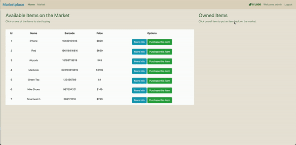

# Market App
This is a web application built with Flask for buying and selling items in a market place.

# Features

- Home page: welcome and home page
    
    

- Register: users can register an account
    
    

- Market: user can see the available items on the market page (unauthenticated users won't be able to access the market page)
    
    

- Logout: Once user logged out, market page cannot be access
    
    

# Technologies Used
- Python
- Flask
- SQLite (sqlalchemy)
- HTML
- CSS
- Bootstrap

# Getting Started

## Installing
1. Clone the repository:

```
$ git clone https://github.com/KenAtopos/Flask_Market_App.git
$ cd market-app
```
2. Install dependencies:
```
$ pip install -r requirements.txt
```
## Usage
1. Run the app:
```
$ flask run
```
2. Navigate to http://localhost:5000 in your browser.

3. Register an account and start buying and selling items.

